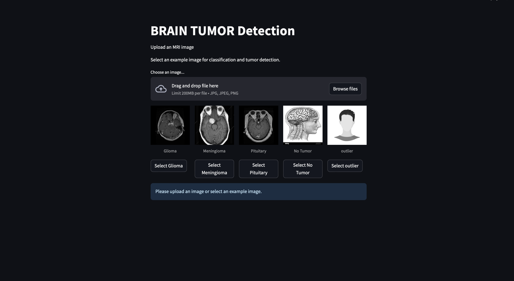
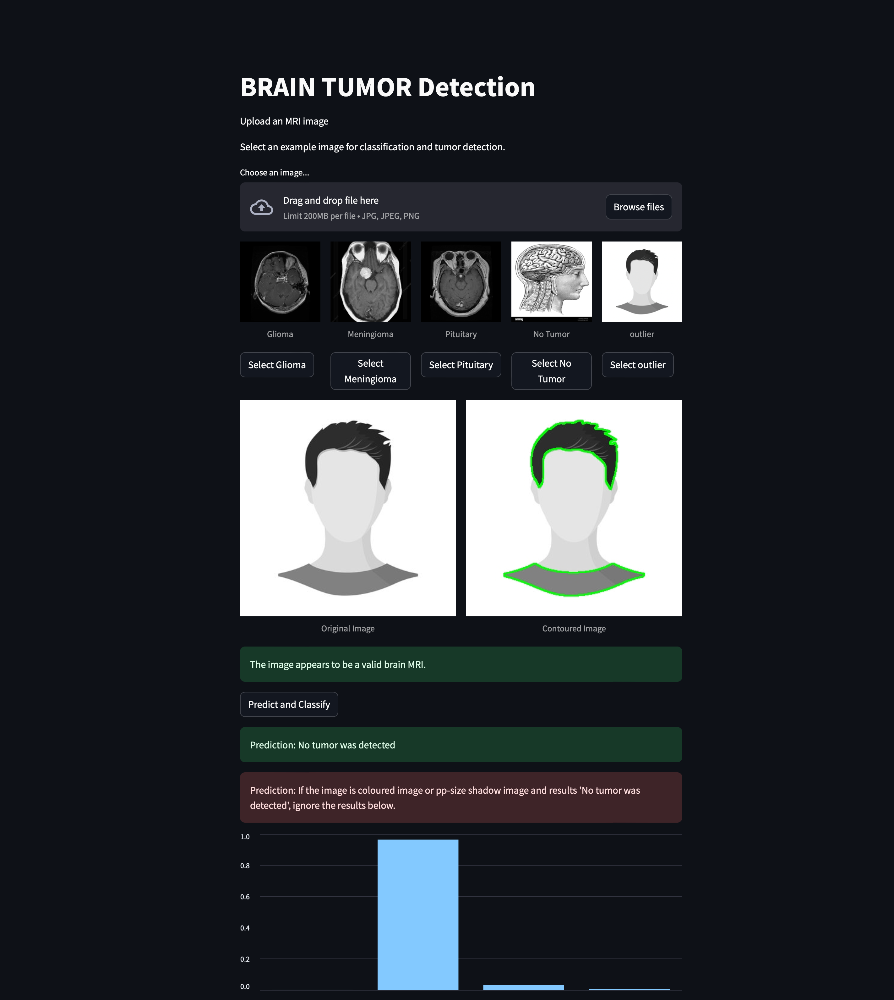
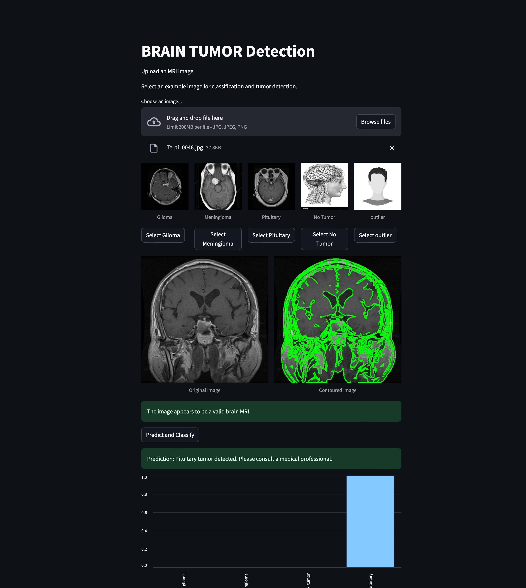

# 🧠 Brain Tumor Detection

This tutorial will guide you through setting up the MRI 🩺 Image Classification app locally. The app allows users to upload MRI images, predict classifications, and visualize results, including tumor contouring. 🎨

## 🚀 Features

- **⬆️ Upload MRI Image**: Allows users to upload an MRI image for classification.
- **🔮 Prediction**: Classifies MRI images into four categories.
- **🔍 Contour Detection**: Displays the original and contoured images side by side.
- **📊 Graph**: Display the confidence graph.

## 📋 Prerequisites

Before you begin, make sure you have the following installed:

1. **🐍 Python 3.10+**
2. **Streamlit** (`pip install streamlit`)
3. **PyTorch** (`pip install torch torchvision`)
4. **🛠️ Other Dependencies**: Run the following to install all necessary dependencies:

   ```bash
   pip install -r requirements.txt
   ```

### 📦 Dataset Details

---

**Dataset URL**: [Brain Tumor MRI Dataset](https://www.kaggle.com/datasets/masoudnickparvar/brain-tumor-mri-dataset)

**About the Dataset**:
A brain tumor is a collection, or mass, of abnormal cells in your brain. Your skull, which encloses your brain, is very rigid. Any growth inside such a restricted space can cause problems. Brain tumors can be cancerous (malignant) or noncancerous (benign). When benign or malignant tumors grow, they can cause the pressure inside your skull to increase. This can cause brain damage, and it can be life-threatening.

It contains 7023 images of human brain MRI scans classified into 4 categories: glioma, meningioma, no tumor, and pituitary. Note that the SARTAJ dataset had issues with incorrect categorization of glioma class images, which were replaced with images from the figshare site to improve accuracy.

### 🧠 Model Details

---

We are using the **EfficientNet-V2-S** model for brain tumor classification. The model is pretrained on ImageNet and fine-tuned on our dataset.

#### 📐 Model Architecture

**EfficientNet-V2-S** is selected for its optimal balance between accuracy and computational efficiency. This architecture utilizes compound scaling, which uniformly scales network depth, width, and resolution using a simple yet highly effective compound coefficient. This approach allows EfficientNet-V2-S to achieve superior performance with fewer parameters compared to traditional models.

#### 🛠️ Fine-Tuning Process

To adapt the EfficientNet-V2-S model to our specific task of brain tumor classification, the following steps were undertaken:

1. **Data Preprocessing**:

   - **Resizing**: All MRI images are resized to **224x224 pixels** to match the input size expected by EfficientNet-V2-S.
   - **Normalization**: Images are normalized using the mean and standard deviation values from ImageNet to ensure consistency with the pretrained model.
   - **Data Augmentation**: Techniques such as random horizontal flips and rotations are applied to enhance the model's ability to generalize.

2. **Model Modification**:
   - **Classifier Adjustment**: The final fully connected layer of the pretrained EfficientNet-V2-S model is replaced to accommodate the **four classes** in our dataset: glioma, meningioma, no tumor, and pituitary.
3. **Training Configuration**:

   - **Loss Function**: Utilized **CrossEntropyLoss** to handle multi-class classification.
   - **Optimizer**: Employed the **Adam optimizer** with a learning rate of **0.01** for efficient training.
   - **Epochs**: The model is trained over **10 epochs**, balancing training time and performance.
   - **Device Setup**: Training is conducted on a **GPU** if available, falling back to **CPU** otherwise, to expedite the training process.

4. **Evaluation Metrics**:

   - **Accuracy**: Measures the percentage of correctly classified MRI images.
   - **Loss**: Tracks the model's performance in minimizing classification errors.
   - **FLOPs and Parameters**: Assessed using `fvcore` to understand the model's computational complexity.

5. **Model Saving**:
   - Post-training, the model's weights are saved as `fine_tuned_efficientnet_v2_s.pth` for future inference and deployment.

#### 🔍 Evaluation Metrics
---
- **Validation Loss**: Indicates how well the model is performing on unseen data, guiding adjustments to training parameters.
- **Validation Accuracy**: Provides a direct measure of the model's effectiveness in correctly classifying MRI images.

#### 📈 Model Performance
---
After fine-tuning, the EfficientNet-V2-S model achieved an accuracy of 95% on the test dataset. This performance demonstrates the model's capability to accurately classify brain tumors, aiding in timely and effective medical interventions.

#### 🛡️ Benefits of Using EfficientNet-V2-S

- **Efficiency**: Delivers high accuracy with fewer parameters, making it suitable for deployment in resource-constrained environments.
- **Scalability**: The compound scaling method allows for easy adjustment based on available computational resources.
- **Proven Performance**: Consistently outperforms many other architectures on various image classification benchmarks, ensuring reliability in medical applications.

---

## 🖥️ Local Setup

### Step 1: 🗄️ Clone the Repository

```bash
git clone https://github.com/alphatechlogics/BrainTumorPrediction.git
cd BrainTumorPrediction
```

### Step 2: 📦 Install Dependencies

Make sure you have all the dependencies installed by running:

```bash
pip install -r requirements.txt
```

### Step 3: ▶️ Run the Streamlit App

To start the app locally, use the following command:

```bash
streamlit run brain_tumor_streamlit.py
```

Once the app is running, you should see an output like this in your terminal:

```bash
  You can now view your Streamlit app in your browser.

  Local URL: http://localhost:xxxx
  Network URL: http://your-ip-address:xxxx
```

Open your browser and navigate to `http://localhost:xxxx` to view the app.

### Step 4: 📤 Upload an MRI Image

1. The UI will prompt you to upload an MRI image. Click on the **"Browse files"** button, select your MRI image, and click **"Open"**.

   

2. After the image is uploaded, the app will display the original MRI image on the left and the contoured image on the right.

   Outlier

3. If the uploaded image is detected as an outlier (not related to MRI), the app will notify you that it is not an MRI image.

### Step 5: 🏷️ Classification and Tumor Contouring

Once the image is uploaded, click the **"Predict"** button. The app will:

- Display the predicted class of the MRI image.
- Show the original MRI image and the corresponding contour of the tumor (if detected) side by side.

  

### Step 6: 🗂️ Select Existing Image for Prediction

If you want to select an existing MRI image (one you previously uploaded), you can choose it from the list, and the app will predict and contour it again, ignoring the previously uploaded image.

---

## 📝 Additional Notes

- Make sure that the MRI image is in a proper format (PNG, JPEG , JPG) and the size matches the model’s input requirements.
- The app is designed to handle images that are outliers by ignoring non-MRI images.

---
